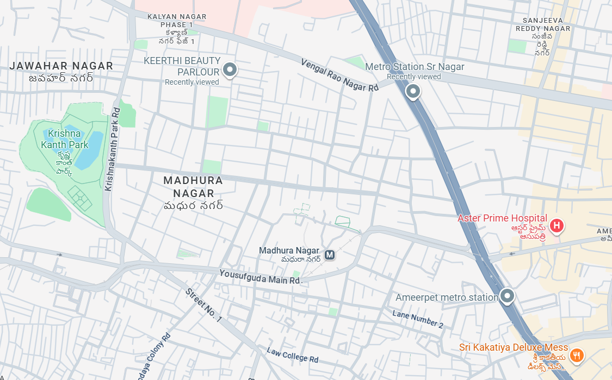
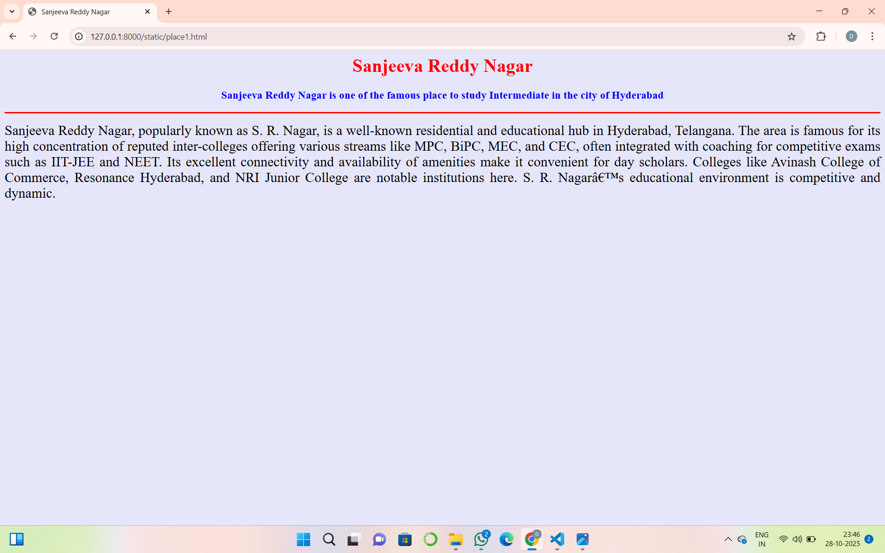
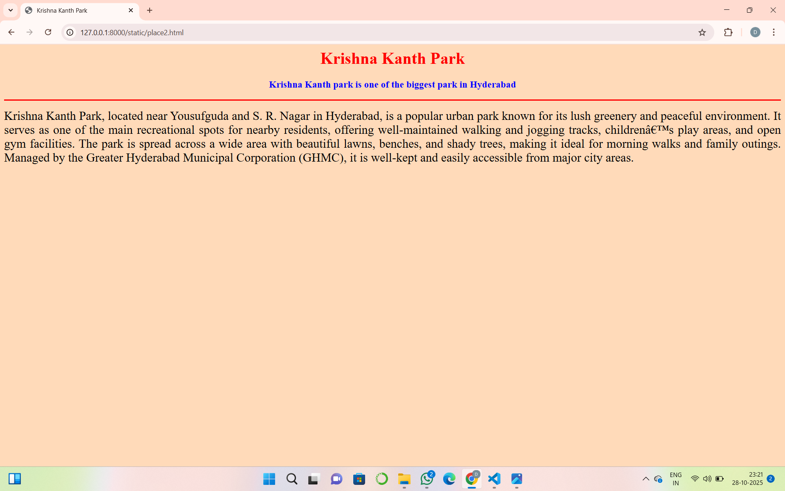
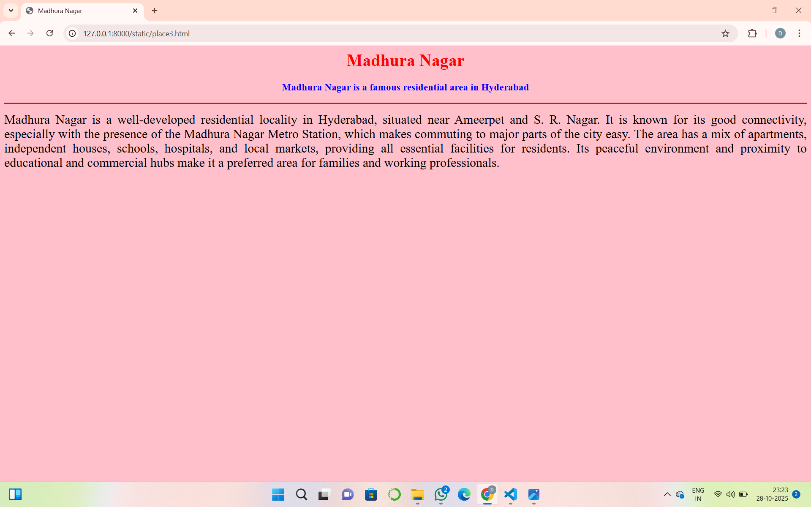
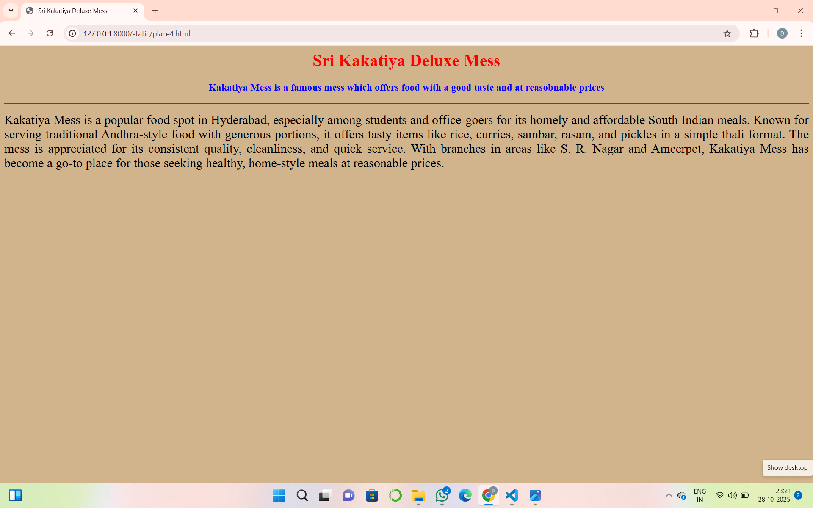

# Ex04 Places Around Me
## Date: 28.10.25

## AIM
To develop a website to display details about the places around my house.

## DESIGN STEPS

### STEP 1
Create a Django admin interface.

### STEP 2
Download your city map from Google.

### STEP 3
Using ```<map>``` tag name the map.

### STEP 4
Create clickable regions in the image using ```<area>``` tag.

### STEP 5
Write HTML programs for all the regions identified.

### STEP 6
Execute the programs and publish them.

## CODE
```
map.html
<html>
<head>
<title>My City</title>
</head>
<body>
<h1 align="center">
<font color="red"><b>HYDERABAD</b></font>
</h1>
<h3 align="center">
<font color="blue"><b></b></font>
</h3>
<center>

<map name="MyCity">
<area shape="rect" coords="500,500,650,600" href="place1.html" title="Sanjeeva Reddy Nagar">
<area shape="rect" coords="640,40,780,140" href="place2.html" title="Krishna Kanth Park">
<area shape="rect" coords="700,300,550,360" href="place3.html" title="Madhura Nagar">
<area shape="rect" coords="400,400,550,500" href="place4.html" title="Sri Kakatiya Deluxe Mess">
</map>
</center>
</body>
</html>

place1.html
<html>
<head>
<title>Sanjeeva Reddy Nagar</title>
</head>
<body bgcolor="lavender">
<h1 align="center">
<font color="red"><b>Sanjeeva Reddy Nagar</b></font>
</h1>
<h3 align="center">
<font color="blue"><b>Sanjeeva Reddy Nagar is one of the famous place to study Intermediate in the city of Hyderabad </b></font>
</h3>
<hr size="3" color="red">
<p align="justify">
<font face="Hyderabad" size="5">
Sanjeeva Reddy Nagar, popularly known as S. R. Nagar, is a well-known residential and educational hub in Hyderabad, Telangana. The area is famous for its high concentration of reputed inter-colleges offering various streams like MPC, BiPC, MEC, and CEC, often integrated with coaching for competitive exams such as IIT-JEE and NEET. Its excellent connectivity and availability of amenities make it convenient for day scholars. Colleges like Avinash College of Commerce, Resonance Hyderabad, and NRI Junior College are notable institutions here. S. R. Nagar’s educational environment is competitive and dynamic.
</p>
<center>
    
    </center>
</body>
</html>

place2.html
<html>
<head>
<title>Krishna Kanth Park </title>
</head>
<body bgcolor="peachpuff">
<h1 align="center">
<font color="red"><b>Krishna Kanth Park</b></font>
</h1>
<h3 align="center">
<font color="blue"><b> Krishna Kanth park is one of the biggest park in Hyderabad</b></font>
</h3>
<hr size="3" color="red">
<p align="justify">
<font face="Hyderabad" size="5">
Krishna Kanth Park, located near Yousufguda and S. R. Nagar in Hyderabad, is a popular urban park known for its lush greenery and peaceful environment. It serves as one of the main recreational spots for nearby residents, offering well-maintained walking and jogging tracks, children’s play areas, and open gym facilities. The park is spread across a wide area with beautiful lawns, benches, and shady trees, making it ideal for morning walks and family outings. Managed by the Greater Hyderabad Municipal Corporation (GHMC), it is well-kept and easily accessible from major city areas.
</p>
<center>
    
    </center>
</body>
</html>

place3.html
<html>
<head>
<title>Madhura Nagar</title>
</head>
<body bgcolor="pink">
<h1 align="center">
<font color="red"><b>Madhura Nagar</b></font>
</h1>
<h3 align="center">
<font color="blue"><b>Madhura Nagar is a famous residential area in Hyderabad </b></font>
</h3>
<hr size="3" color="red">
<p align="justify">
<font face="Hyderabad" size="5">
Madhura Nagar is a well-developed residential locality in Hyderabad, situated near Ameerpet and S. R. Nagar. It is known for its good connectivity, especially with the presence of the Madhura Nagar Metro Station, which makes commuting to major parts of the city easy. The area has a mix of apartments, independent houses, schools, hospitals, and local markets, providing all essential facilities for residents. Its peaceful environment and proximity to educational and commercial hubs make it a preferred area for families and working professionals.
</p>
<center>
    
    </center>
</body>
</html>

place4.html
<html>
<head>
<title>Sri Kakatiya Deluxe Mess</title>
</head>
<body bgcolor="tan">
<h1 align="center">
<font color="red"><b>Sri Kakatiya Deluxe Mess</b></font>
</h1>
<h3 align="center">
<font color="blue"><b>Kakatiya Mess is a famous mess which offers food with a good taste and at reasobnable prices </b></font>
</h3>
<hr size="3" color="red">
<p align="justify">
<font face="Hyderabad" size="5">
Kakatiya Mess is a popular food spot in Hyderabad, especially among students and office-goers for its homely and affordable South Indian meals. Known for serving traditional Andhra-style food with generous portions, it offers tasty items like rice, curries, sambar, rasam, and pickles in a simple thali format. The mess is appreciated for its consistent quality, cleanliness, and quick service. With branches in areas like S. R. Nagar and Ameerpet, Kakatiya Mess has become a go-to place for those seeking healthy, home-style meals at reasonable prices.
</p>
<center>
    
    </center>
</body>
</html>

```

## OUTPUT






## RESULT
The program for implementing image maps using HTML is executed successfully.
